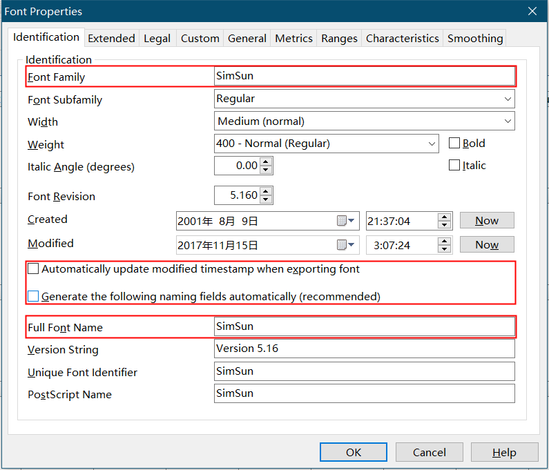

### 字体中文名显示
OnlyOffice暂不支持显示中文字体的中文名  
需要对字体文件进行修改，修改英文名为中文名  
使用FontCreator修改需要显示中文名的中文字体文件  
修改步骤如下：  

已修改可直接使用字体
[https://pan.baidu.com/s/12dVnKwvxBN1BgkKWlF_SFQ](https://pan.baidu.com/s/12dVnKwvxBN1BgkKWlF_SFQ)
提取码: y39g